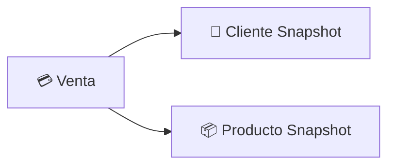
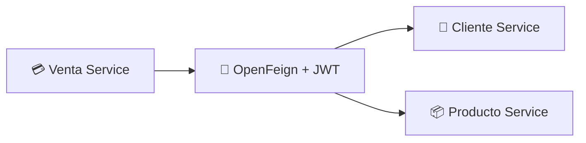
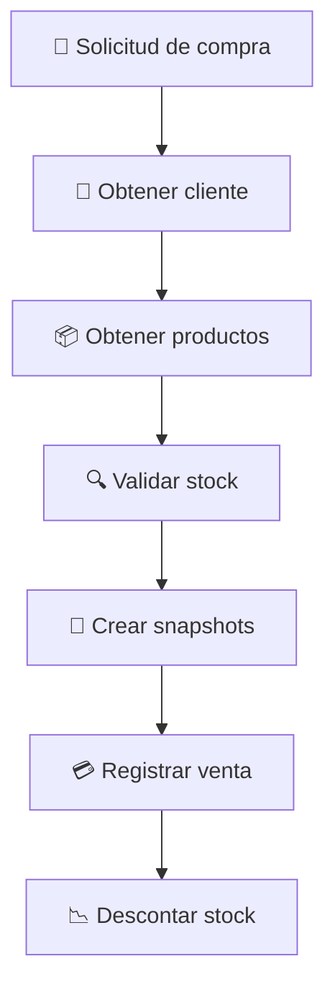

<div align="center">

# 💳 Venta Service

### Microservicio de gestión de ventas
#### ElectrodoStore · Spring Boot · OAuth2 Resource Server · OpenFeign


</div>

---

Venta Service es responsable de la gestión del ciclo de vida de las ventas dentro de **ElectrodoStore**.

Mantiene el historial comercial de las compras realizadas por los clientes, preservando snapshots de productos y clientes para garantizar consistencia histórica.

Implementa seguridad basada en **OAuth2 Resource Server**, ownership mediante claims JWT e integración distribuida con otros dominios del sistema.

---

## 🎯 Responsabilidades

- 💳 Registro de ventas
- 📜 Consulta de historial de compras
- ❌ Cancelación de ventas
- 📦 Validación y actualización de inventario
- 👤 Preservación de snapshots de clientes
- 🛍️ Preservación de snapshots de productos
- 🔐 Protección basada en ownership
- 📡 Propagación de identidad entre microservicios

---

## 🧰 Stack tecnológico


---

## 📦 Modelo de dominio



### Entidad Venta

| Campo | Descripción |
| --- | --- |
| `id` | Identificador de la venta |
| `date` | Fecha de registro |
| `totalItems` | Cantidad total de productos |
| `totalPrice` | Valor total de la venta |
| `listProducts` | Snapshot de productos |
| `client` | Snapshot del cliente |
| `status` | Estado actual de la venta |

---

## 📸 Snapshots

Las ventas almacenan snapshots de cliente y productos, lo que permite:

- Preservar información histórica
- Evitar inconsistencias ante modificaciones posteriores
- Reducir dependencias de lectura hacia otros servicios
- Mantener trazabilidad comercial

---

## 🔄 Estados de la venta

| Estado | Descripción |
| --- | --- |
| `PENDING` | Venta registrada pendiente de completar |
| `COMPLETED` | Venta completada exitosamente |
| `CANCELED` | Venta cancelada |
| `RETURNED` | Venta devuelta |

---

## 🔐 Modelo de seguridad

Venta Service funciona como **OAuth2 Resource Server**. Los JWT son emitidos por Auth Service y validados localmente mediante RSA256.

### Claims utilizados

| Claim | Descripción |
| --- | --- |
| `sub` | Username autenticado |
| `userId` | Identificador interno del usuario |
| `clientId` | Identificador del cliente |

---

## 👤 Ownership

Las operaciones realizadas por clientes utilizan el claim `clientId` obtenido desde el JWT, lo que evita que un cliente pueda:

- Registrar ventas en nombre de otros clientes
- Cancelar ventas pertenecientes a otros clientes
- Consultar información comercial ajena

> La identidad utilizada para operaciones de negocio proviene del claim `clientId`, no de parámetros enviados por el usuario.

---

## 🔗 Integración entre microservicios



### Integraciones

| Servicio | Propósito |
| --- | --- |
| `cliente-service` | Obtención de información del cliente |
| `producto-service` | Consulta, validación y actualización de stock |

**Características:**

- 🔗 Comunicación síncrona vía OpenFeign
- 🪙 Propagación automática del JWT
- 🔍 Descubrimiento dinámico con Eureka
- ⚖️ Balanceo con Spring Cloud LoadBalancer

---

## 💳 Flujo de registro de venta



---

## 🛡️ Resiliencia

Las integraciones externas están protegidas mediante:

| Mecanismo | Propósito |
| --- | --- |
| **Retry** | Reintentos automáticos ante fallos transitorios |
| **Circuit Breaker** | Aislamiento de fallos |
| **Fallback** | Respuestas controladas ante degradación |

> Esto evita propagación de errores de infraestructura hacia los consumidores.

---

## ⚠️ Manejo de errores

Se utiliza manejo centralizado mediante `@RestControllerAdvice`, códigos de error de dominio, traducción de errores Feign y respuestas consistentes.

```json
{
  "timestamp": "...",
  "status": 404,
  "error": "NOT_FOUND",
  "errorCode": "PRODUCT_NOT_FOUND",
  "message": "Producto no encontrado"
}
```

---

## 🔍 Traducción de errores remotos

Los `ErrorDecoder` permiten transformar errores HTTP remotos en excepciones de dominio propias.

| Error remoto | Excepción local |
| --- | --- |
| `CLIENT_NOT_FOUND` | `ClienteNotFoundException` |
| `PRODUCT_NOT_FOUND` | `ProductoNotFoundException` |
| `PRODUCT_STOCK_INSUFFICIENT` | `ProductoStockInsuficienteException` |

---

## 🌐 Endpoints

### 👨‍💼 Administración

| Método | Endpoint | Descripción |
| --- | --- | --- |
| `GET` | `/ventas` | Listar ventas |
| `GET` | `/ventas/{id}` | Obtener venta |
| `PATCH` | `/ventas/{id}/admin/cancel` | Cancelación administrativa |

### 👤 Cliente

| Método | Endpoint | Descripción |
| --- | --- | --- |
| `GET` | `/ventas/cliente/{clientId}` | Consultar ventas de cliente |
| `PATCH` | `/ventas/{id}/cancel` | Cancelar venta |

### 🔗 Integración interna

| Método | Endpoint | Descripción |
| --- | --- | --- |
| `POST` | `/ventas` | Registrar venta desde carrito-service |

> ⚠️ Algunos endpoints son utilizados actualmente por otros microservicios mediante JWT de usuario propagado. En futuras versiones se implementará autenticación específica entre microservicios.

---

## 🏗️ Arquitectura

- 🌐 API Gateway como punto único de entrada
- 🔐 JWT validado localmente mediante OAuth2 Resource Server
- 👤 Ownership basado en claim `clientId`
- 📸 Preservación histórica mediante snapshots
- 🔗 Comunicación síncrona mediante OpenFeign
- 🔍 Descubrimiento dinámico con Eureka
- 🛡️ Resiliencia mediante Retry y Circuit Breaker
- 🗄️ Database per Service

---

## 💡 Decisiones de diseño

<details>
<summary><b>📸 Snapshots embebidos</b></summary>
<br>
Las ventas almacenan snapshots de clientes y productos para preservar el contexto exacto de la transacción, garantizando trazabilidad histórica independientemente de cambios futuros en otros servicios.
</details>

<details>
<summary><b>🔐 Ownership basado en JWT</b></summary>
<br>
Las operaciones del cliente utilizan el claim <code>clientId</code> como identidad de negocio, sin depender de parámetros enviados por el usuario.
</details>

<details>
<summary><b>🧩 Separación de dominios</b></summary>
<br>
Venta Service no administra clientes ni productos; consume información de sus servicios propietarios mediante OpenFeign.
</details>

<details>
<summary><b>📡 Propagación de identidad</b></summary>
<br>
Las llamadas distribuidas mantienen el contexto de seguridad mediante JWT, propagado automáticamente a través de interceptores Feign.
</details>

<details>
<summary><b>🗄️ Database per Service</b></summary>
<br>
El servicio mantiene su propia base de datos y no accede directamente a bases de datos externas, reduciendo el acoplamiento entre dominios.
</details>

---

## 🚀 Mejoras futuras

| Mejora | Descripción |
| --- | --- |
| 🔑 **M2M Auth** | Autenticación específica entre microservicios |
| 📨 **Eventos asincrónicos** | Kafka o RabbitMQ para desacoplamiento temporal |
| 📡 **Observabilidad** | Tracing distribuido con Zipkin / OpenTelemetry |
| 📋 **Auditoría** | Registro de operaciones críticas |
| 🔄 **Devoluciones** | Implementación completa del flujo de devolución |

